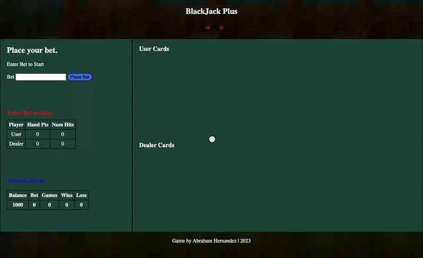
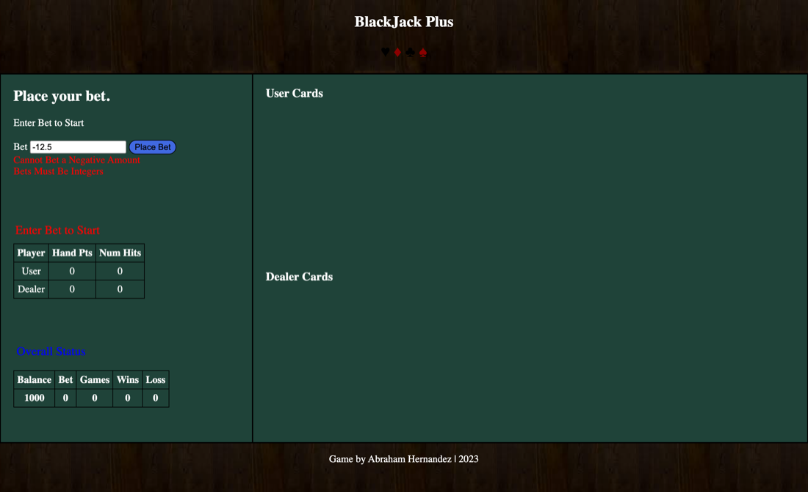
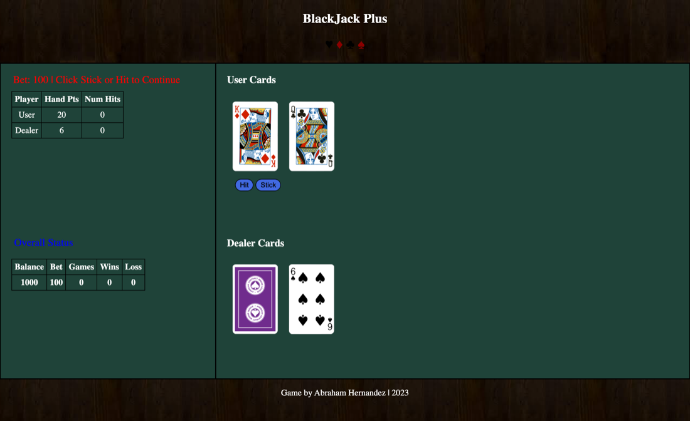
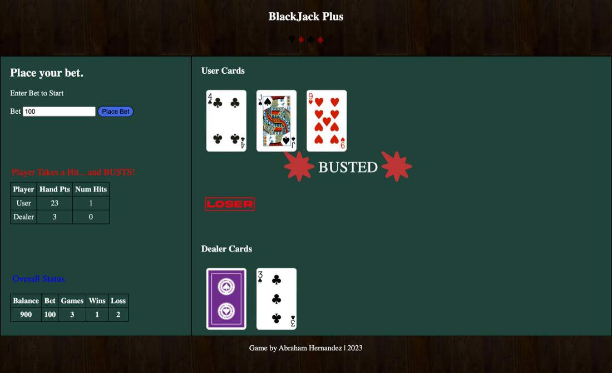
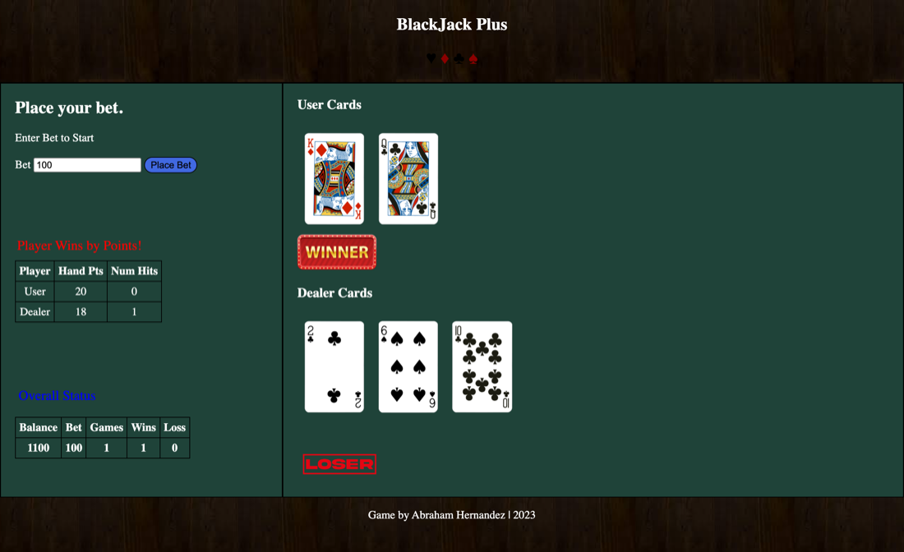

<h1 align="center">BlackJack Plus</h1>

<p align="center">
  A blackjack table in the browser, written in plain HTML, CSS and JavaScript.
</p>

<p align="center">
  <a href="#features">Features</a> ·
  <a href="#quick-start">Quick start</a> ·
  <a href="#how-it-works">How it works</a> ·
  <a href="#known-issues">Known issues</a>
</p>

<p align="center">
  
  
  
  
  
  <a href="LICENSE"></a>
</p>

<p align="center">
  
</p>

You start with 1,000 chips, bet up to 500 a hand, and play against a dealer
whose first card stays face down until you stick. Every hand updates a running
balance and a win and loss record. I wrote it in 2023 as a course assignment:
the game logic is my own JavaScript with no framework and no build step, and
the only outside dependency is a Font Awesome kit used for the bust animation.

## Features

<table>
  <tr>
    <td width="50%" valign="top">
      <b>Bet validation</b><br><br>
      <br>
      A bet has to be a whole number, above zero, no more than 500 and no more than your balance. Every rule a bet breaks is listed at once instead of one error at a time.
    </td>
    <td width="50%" valign="top">
      <b>Hidden hole card</b><br><br>
      <br>
      The dealer's first card is dealt face down, and the dealer total only counts the card you can see.
    </td>
  </tr>
  <tr>
    <td width="50%" valign="top">
      <b>Hit or stick</b><br><br>
      <br>
      Draw as many cards as you like; going over 21 ends the hand immediately with a bust.
    </td>
    <td width="50%" valign="top">
      <b>Results you can see</b><br><br>
      <br>
      Winner and loser badges, a busted animation and a blackjack badge mark how each hand ended.
    </td>
  </tr>
  <tr>
    <td width="50%" valign="top">
      <b>Running balance</b><br>
      Wins pay 1 to 1, and the balance, current bet, games, wins and losses stay on screen. A two-card natural (Ace plus any 10, Jack, Queen or King) pays 2 to 1.
    </td>
    <td width="50%" valign="top">
      <b>Out of funds</b><br>
      When the balance hits zero, betting locks and a Restart button resets the bankroll, the win and loss record and the deck.
    </td>
  </tr>
  <tr>
    <td width="50%" valign="top">
      <b>Dealer turn</b><br>
      After you stick, the hole card flips and a Dealer Play button steps the dealer's hand one card at a time. The dealer draws until reaching at least 17 or busting. The house wins ties once the dealer reaches 17.
    </td>
    <td width="50%" valign="top">
      <b>52 cards, tracked</b><br>
      Each card is marked as dealt, so no card repeats until the deck runs out.
    </td>
  </tr>
  <tr>
    <td width="50%" valign="top">
      <b>Reshuffle</b><br>
      When the deck is empty it reshuffles, holding back every card still on the table in either hand.
    </td>
    <td width="50%" valign="top">
      <b>Layout</b><br>
      Breakpoints at 750px and 450px shrink the table, text and cards for tablets and phones. It stays two columns, so on a small phone the text gets very small and a long hand can run into the footer.
    </td>
  </tr>
</table>

## Quick start

Nothing to install. Clone it and open the page:

```bash
git clone https://github.com/cl0ax/BlackJack-Game.git
cd BlackJack-Game
open jack.html        # macOS; on Windows use: start jack.html
```

Run the automated game-logic tests with Node.js:

```bash
node --test
```

Or serve it locally:

```bash
python3 -m http.server 8000
# then visit http://localhost:8000/jack.html
```

The Font Awesome kit loads from the web, so the bust animation needs a network
connection; the game itself does not.

## How it works

The source is three files, with the card and badge artwork in `images/`.

| File | What it holds |
| --- | --- |
| `jack.html` | The table: bet form, status tables, card areas and buttons |
| `javascriptBJ.js` | The game: a set of objects plus two top-level functions |
| `style.css` | Table layout, colors and the two breakpoints |

`javascriptBJ.js` is built around a few objects that call into each other:
`Deck` deals random undealt cards, `Player` and `Dealer` hold a hand and the
actions each side can take, `UI` validates bets and draws the hands and status
tables, `Blackjack` holds the payout rates and the blackjack check, and
`GameState` handles running out of funds. Responsibilities overlap: `Player`
and `Dealer` also write result messages and badges to the page directly.

A hand starts in `startGame()`, which validates the bet, resets both hands,
deals two cards each and checks for an immediate blackjack before handing
control to the Hit and Stick buttons.

## Known issues

Wins, losses and reshuffles are announced with browser `alert()` dialogs.

## License

MIT. See [LICENSE](LICENSE).
